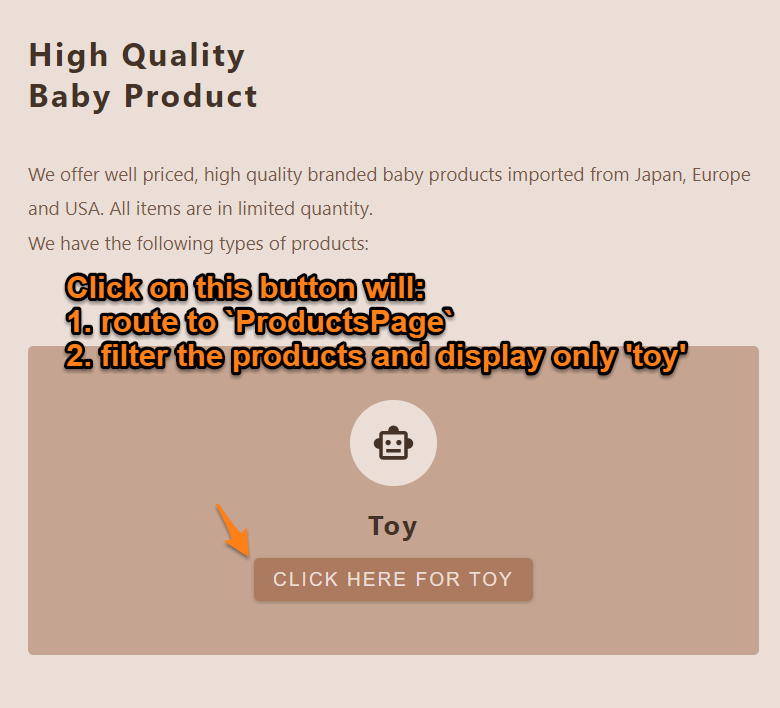
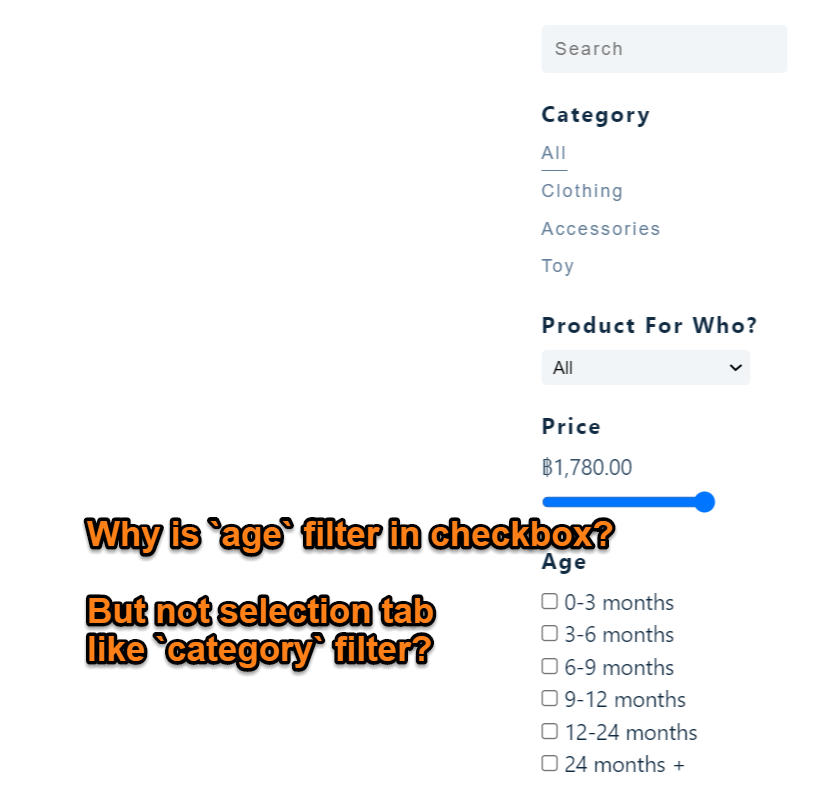
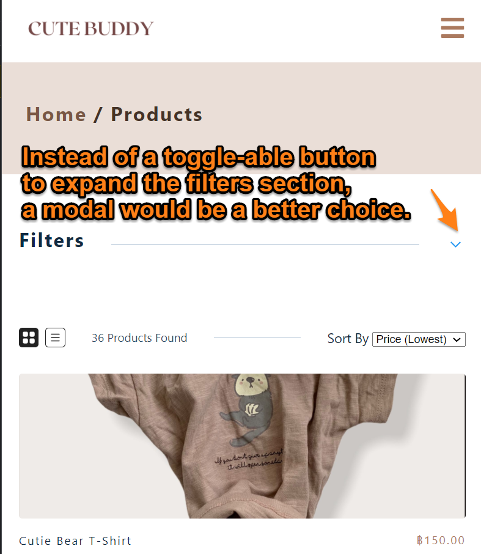

# TypeScript e-commerce store

## Demo of this app:


### Or Go to the live site and try it for yourself [here](https://cute-buddy.netlify.app/)

## What is this project about?

- This is an e-commerce app that allows shoppers to view, sort, and filter products according to different criteria. After products are added to the shopping cart, payment is processed with Stripe API.
- This serves as a TypeScript, Sanity CMS, GraphQL, and Stripe API learning project. I took the skeleton of [this Udemy course project](https://react-course-comfy-sloth-store.netlify.app/). The differences between the original one and my version are:
  - replaced the JavaScript code with TypeScript.
  - Instead of using dummy data and API provided by the Udemy course, I use some real product data from a friend's Instagram store. Sanity CMS is used to host the data, GraphQL is used to query the data.

## What technologies were used?

- react.js (create-react-app)
- TypeScript

### Styling:

- styled-components
- CSS

### Routing:

- react-router

### Payment processing:

- Stripe API

### CMS:

- Sanity
- GraphQL
- axios

### Hosting and server side functions

- Netlify

## Links to source code and live site:

- [Live site hosted on Netlify](https://cute-buddy.netlify.app/)
- [Source code on Github](https://github.com/-1codingguy/typescript-e-commerce)
- [GraphQL playground for CMS data hosted on Sanity](https://bqk6gkzk.api.sanity.io/v1/graphql/production/default)

## How to navigate this project? Click on the link for related source code:

1. A simple [Sanity CMS schema](https://github.com/1codingguy/typescript-e-commerce/blob/main/cutebuddy/schemas/product.js) is used: add, amend or delete product can be done on the CMS instead of in the source code.

2. Click on each `ServicesCard` button will do two things:

- route to `ProductsPage`;
- filter the products according to which button gets clicked on.
  
  - To achieve this, it has to go through three steps:

1. clear the previous filters
2. set `isClickFromServices` state variable to tru
3. update filters according to the button that gets clicked on

[Click here](https://github.com/1codingguy/typescript-e-commerce/blob/main/src/components/Services/ServicesCards.tsx#L21) for the relevant code.

- Why is there a `isClickFromServices` variable?
  - `ProductsPage` should display products of relevant service if routed from `Services` component.
  - But each time `ProductsPage` is mounted, `filters` are cleared since the page should display all products.
  - That means there are two cases for `ProductsPage`:
    - when the component mounts `filters` are cleared.
    - when the component mounts, and it is routed from `Services` component, `filters` should contain a value.
  - Therefore, an if statement is used to check if the page is routed from `Services`, [click here for the relevant code](https://github.com/1codingguy/typescript-e-commerce/blob/main/src/pages/ProductsPage.tsx#L10).

3. Shoppers can choose to view the products in `ListView` or `GridView`. [Click here for relevant code](https://github.com/1codingguy/typescript-e-commerce/blob/main/src/components/ProductList.tsx#L24).

4. Shoppers are able to filter products by different criteria, such as keyword, price, etc.

- [Click here for code structure](https://github.com/1codingguy/typescript-e-commerce/blob/main/src/components/Filters/Filters.tsx#L22);
- [Click here for filters updating function](https://github.com/1codingguy/typescript-e-commerce/blob/main/src/reducers/filter_reducer.ts#L61).

5. Products can be sorted by price or name, in ascending or descending order [Click here for sorting function](https://github.com/1codingguy/typescript-e-commerce/blob/main/src/reducers/filter_reducer.ts#L41).

6. Payment is processed by Stripe API, [click here for relevant code](https://github.com/1codingguy/typescript-e-commerce/blob/main/src/components/CheckoutForm.tsx).

7. Please note that the newsletter subscription part on `HomePage` does not do anything.
## Why did I build the project this way?

### About filtering:

Lots of thoughts were given about filter functions related to 'age' and 'height' because of the nature of the baby product. I am listing some reasons why `age` and `height` filters are set up in this way:

1. create "baskets of categories"

- Baby products, in general, are labelled as suitable for different ages, for instance:
  - 3-6 months
  - under 1 year old, or
  - all ages
- To filter the products according to these age descriptions, first I need to create some "baskets" of fixed categories like these:
  - 0-3 months
  - 3-6 months
  - 6-9 months
  - 9-12 months
  - 12-24 months
  - 24 months +
- Then assign a product one or more of these categories. For example,
  - if a product is suitable for an infant of `3-6 months`, then assign only such category.
  - if a product is labelled `0+`, i.e. suitable for all ages, then all of these categories should be assigned to the product.

2. Why use checkboxes for `age` filter, instead of selection tabs like `category`?

- A product can only be either a piece of `toy` or a piece of `clothing`, but cannot be both. Click on the selection tab of `toy` should display all the `toy` products.
- But a product can be suitable for multiple age categories, for example, a product for an infant under 6 months should have both `0-3 months` and `3-6 months`. Since multiple choices can be selected at the same time, checkboxes should be used.
- By default when the page mounts, it displays all products, which implicitly means none of the filters are applied. So a checkbox of `all` is not needed for `age` (unlike `category` filter) because the app should allow the user to apply different criteria one by one, instead of applying all the filters for the user by default.

- 

3. Other than the 'category baskets', there should be text descriptions about `age` and `height`.

- if a product is suitable for an infant of height 65 cm, it is inside the category of `60-69 cm` for filtering purposes.
- But in the `singleProductPage`, it states "suitable for height: 65cm" to provide some readable text to the user.
- That means there are two fields related to 'height' factor in the Schema:
  - `height` refers to the categories (e.g. '60-69 cm'), a product can have zero or multiple of such categories.
  - `heightDescription` refers to the text description specified from the product manufacturer, which is also a more precise product description in readable text.

### Why react-router v5 instead of the latest react-router v6?

- When I started the project, the latest react-router v6 was released.
- I chose to keep using react-router v5 instead since this project is mainly a TypeScript learning project. Adapting to the latest version of react-router wasn't my priority.

## What can be further improved?

1. Filter in mobile view should use a modal instead of a toggle-able menu.
   

2. Schema design should take into account that that one product can have different variants. For instance, A product with different colours and sizes.
   - Different variants of a product should have the same `product_id`, but a different `SKU`. But since this is not a real store that gets used, it is not implemented in this project.

## How can you clone and tweak this project?

From your command line, first clone this repo:

```
# Clone this repository
$ git clone https://github.com/1codingguy/typescript-e-commerce.git

# Go into the repository
$ cd typescript-e-commerce

# Remove current origin repository
$ git remote remove origin

```

Then you can install the dependencies using NPM:

```
# Install dependencies
$ npm install

# Start development server
$ npm start
```

Happy coding!

---

## Author

**coding-guy**

- [GitHub](https://github.com/1codingguy)
- [Blog](https://blog.coding-guy.com/)
- [Twitter](https://twitter.com/1codingguy)
